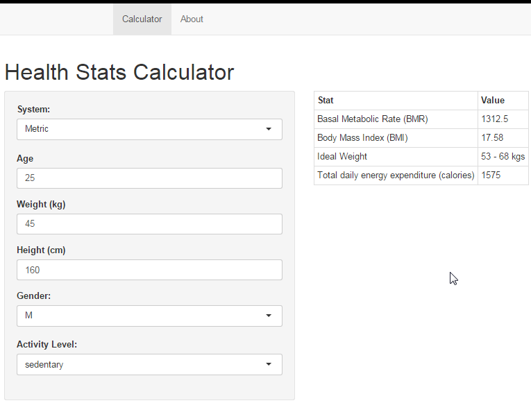

Health Stats Calculator
========================================================
Author: Paul Comeau
Date: 5/23/2015

<small>
Developing Data Products     
Project Presentation
</small>

========================================================

Monitor Your Health Stats 
--

- Intutitve User Interface
- Consise Output
- Provides:
- Basal Metabolic Rate (BMR)
 - Body Mass Index (BMI)
 - Ideal Weight Range
 - Total Daily Energy Expediture

Example
========================================================

For female, age 30, Weight 155, height 65

Resulting BMI 25.79

Resulting BMR 1493.75

Intuitive User Interface
========================================================

Start Using the Health Stats Calculator NOW !!
========================================================

https://pcomeau.shinyapps.io/project/
